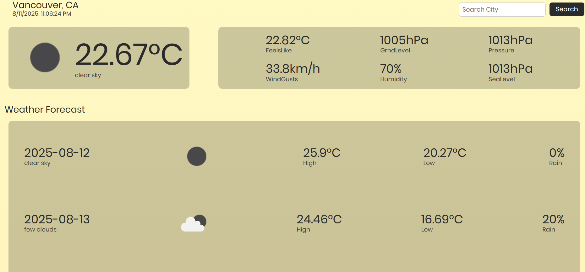
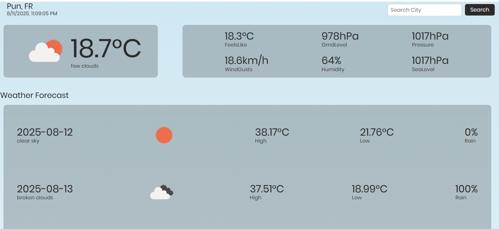
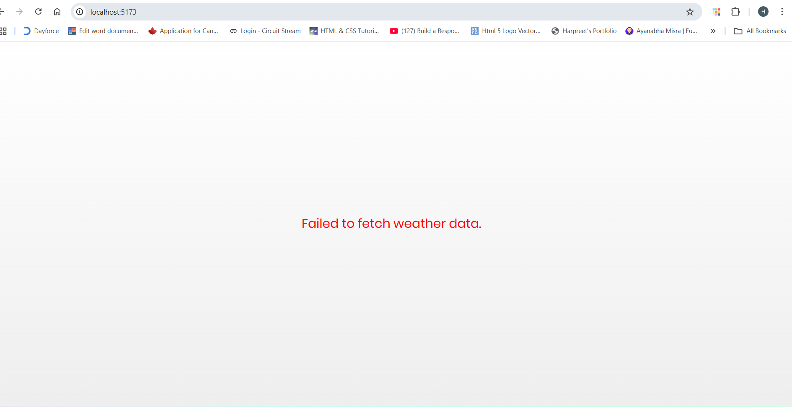
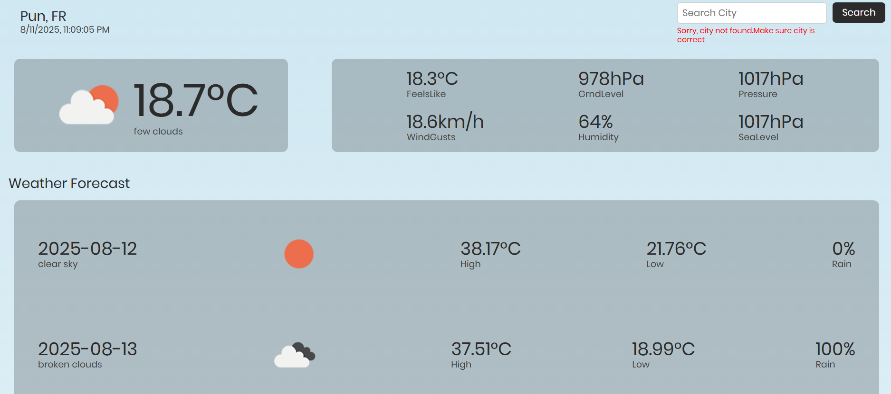
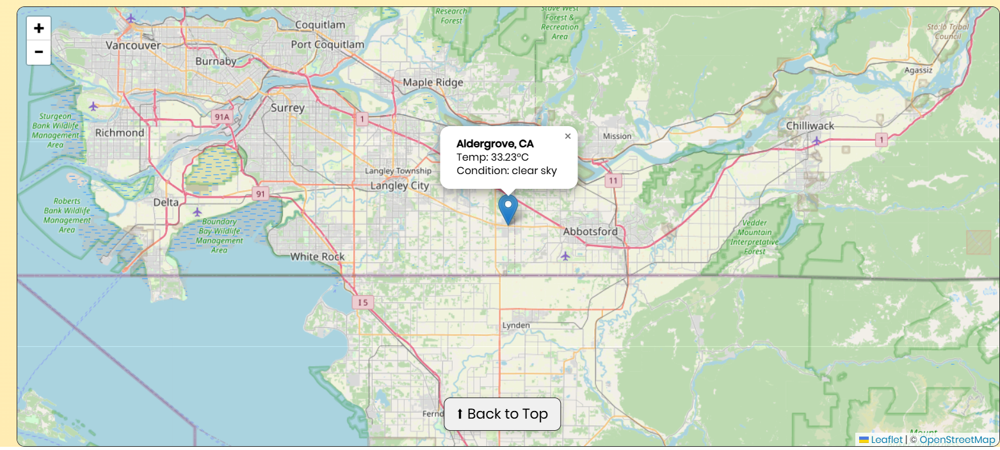
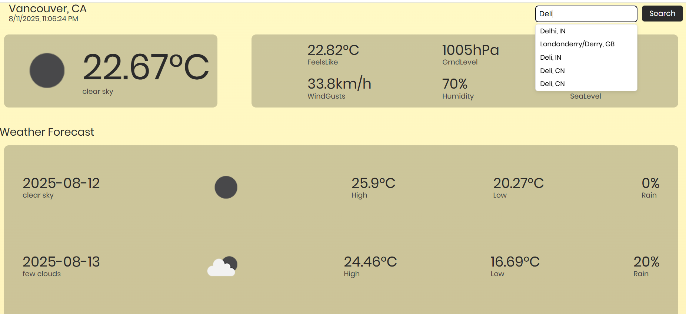
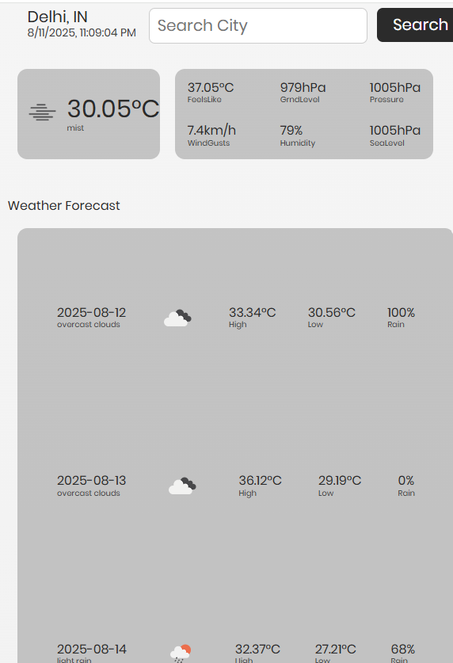

# React Weather App

A modern React weather application built with TypeScript that fetches and displays current weather, 5-day forecasts, and location data for any city. The app features dynamic backgrounds, an interactive map, loading states, error handling, and smooth user experience.

---

## Features

- Search weather by city name with live updates  
- Display current temperature, weather conditions, location, and local time  
- 5-day forecast display with daily summaries  
- Dynamic background gradients based on weather condition text  
- Interactive Leaflet map centered on searched city with weather popup marker  
- Loader animation while data is fetching  
- Back-to-top button appears on scroll for easy navigation  
- Inline error messages shown when city is not found, without clearing existing data  
- City suggestions dropdown with live search for improved user experience

---

## Tech Stack

- React 19 + TypeScript — building UI with type safety  
- Leaflet.js — map rendering and weather location markers  
- Vite — fast modern build tool and dev server  
- CSS Modules — scoped CSS styling for components  
- OpenWeatherMap API — fetching weather and location data  

---

## Error Handling

- Displays user-friendly messages for invalid city names  
- Detects and alerts on network issues or other API failures  
- Retains previously loaded weather data when errors occur  

---

## Styling

Uses CSS Modules for scoped styling with dynamic backgrounds and responsive layouts.

---

## Components Details

### fetchWeatherFromAPI.ts

Fetches current weather and 5-day forecast data from OpenWeatherMap API.

- Handles 404 errors by returning null for city-not-found cases  
- Throws errors for other HTTP failures  
- Groups forecast by date and calculates daily summaries  

---

### fetchCitySuggestions.ts

Fetches city name suggestions from OpenWeatherMap Geocoding API based on user input.

- Called with a city query string  
- Returns a filtered list of city names and countries for live suggestions  
- Used by the Header component for live city suggestions  

---

### App.tsx

The main component managing state and rendering all child components. Handles fetching weather data dynamically on city search with loading and error states.

- Uses useState and useEffect hooks for state and side effects  
- Implements a minimum loader delay for smooth UX  
- Dynamically changes background based on weather condition text  
- Conditionally renders Loader, error messages, current weather, forecast, and map components  

---

### Header.tsx

Manages city search input and displays current location with local time.

- Uses controlled input with local state for city name  
- Displays suggestion dropdown below input box with clickable items  
- Calls onCitySearch prop on form submit or suggestion click  
- Shows inline error messages  
- Uses CSS Modules for styling input, buttons, location info, suggestions, and errors  

---

### CurrentWeather.tsx

Displays the current weather conditions, temperature, location info, and weather icon.

- Uses a 3-column layout to show details like feels-like temp, wind gusts, pressure, humidity, etc.  
- Uses CSS Modules for styling and conditional rendering of missing values  

---

### Forecast.tsx

Shows a 5-day forecast with daily max/min temperatures, chance of rain, and weather conditions.

- Groups raw forecast data by date  
- Selects midday forecast data for a representative condition icon  
- Uses map rendering for each day’s summary  

---

### Map.tsx

Uses React Leaflet to render an interactive map centered on the searched city’s coordinates.

- Accepts location and weather props for dynamic display  
- Fixes Leaflet’s default icon issue with custom icon URLs  
- Displays marker with popup showing city, country, temperature, and condition  

---

### Footer.tsx

A simple footer component that shows a "Back to Top" button when the user scrolls down more than 300 pixels.

- Uses useState and useEffect to track scroll position  
- Adds and cleans up scroll event listeners  
- Smoothly scrolls the page back to the top when the button is clicked  

---

### Loader.tsx

A loader component that displays a loading animation while data is being fetched.

- Accepts an isLoading boolean prop  
- Returns null (renders nothing) when isLoading is false  
- Shows a styled loader div when isLoading is true  

---

## Screenshots

Default Weather  

Conditional Background  

Network Error Handling  

Location Error  

Map  

City Sugesstions 

Responsive Design

## Challenges 
-Figuring out when to show the loader, error messages, or the weather info was kinda tricky. Had to make sure error messages didn’t mess up the layout.

-Getting my head around TypeScript types and making sure I defined and used them right was a little consfusing 

-Bringing the  the input box and search button to sit nicely side by side, while keeping the error message right under the input without messing up the button's position, was little tricky. Also, placing the suggestion box just below the input was a bit of a pain.

-Adding delays so the suggestion box and loader show smoothly 

-Figuring out how to show different error messages for typos, API errors, or network problems was a bit of a challenge.

## Wins

- Clean, Responsive UI Layout
- Type-safe Code 
- Smooth City Suggestions
- Smooth visible loader
- Complete Error Handling 

